# Linux y la Terminal Desde Cero

Aprende los fundamentos de Linux y la terminal desde cero, usando Ubuntu Server en VirtualBox como laboratorio seguro para practicar comandos esenciales.

## Ruta De Aprendizaje

| Bloque | Tema | Ir |
|---|---|---|
| 01 | Linux y su importancia actual | [Abrir](./clases/01-linux-importancia.md) |
| 02 | Ubuntu Server en VirtualBox | [Abrir](./clases/02-ubuntu-server-virtualbox.md) |
| 03 | Terminal, shell y sistema de archivos | [Abrir](./clases/03-terminal-sistema-archivos.md) |
| 04 | Comandos esenciales | [Abrir](./clases/04-comandos-esenciales.md) |

> El indice sigue la linea del PPT: Linux y su importancia actual, Ubuntu Server en VirtualBox, terminal/comandos esenciales y laboratorio practico.

### Mapa Rapido De La Guia

```mermaid
flowchart LR
    A["Linux"] --> B["Distribuciones"]
    B --> C["Ubuntu Server"]
    C --> D["VirtualBox"]
    D --> E["Terminal y Bash"]
    E --> F["Sistema de archivos"]
    F --> G["Comandos esenciales"]
    G --> H["Laboratorio"]

    style A fill:#1f6feb,stroke:#58a6ff,color:#fff
    style B fill:#238636,stroke:#3fb950,color:#fff
    style C fill:#8957e5,stroke:#bc8cff,color:#fff
    style D fill:#30363d,stroke:#8b949e,color:#fff
    style E fill:#9e6a03,stroke:#d29922,color:#fff
    style F fill:#1f6feb,stroke:#58a6ff,color:#fff
    style G fill:#238636,stroke:#3fb950,color:#fff
    style H fill:#da3633,stroke:#f85149,color:#fff
```

## Laboratorio

| Laboratorio | Descripcion | Ir |
|---|---|---|
| Estructura de proyecto en Linux | Crear carpetas, archivos, contenido, copias y validacion desde terminal | [Abrir](./laboratorios/estructura-proyecto-linux.md) |

## Material De Apoyo

| Material | Descripcion |
|---|---|
| [Guia visual completa](./material/presentacion-linux-terminal-sesion-1.pdf) | Presentacion principal de la sesion 1: Linux y terminal. |

## Recursos Complementarios

| Recurso | Enlace |
|---|---|
| Ubuntu Server | [ubuntu.com/server](https://ubuntu.com/server) |
| Oracle VirtualBox | [virtualbox.org](https://www.virtualbox.org/) |
| Ubuntu CLI Cheat Sheet | [assets.ubuntu.com](https://assets.ubuntu.com/v1/d00791ae-ubuntu_cli_cheat_sheet_2025.pdf) |

Al terminar esta sesion deberias poder explicar que es Linux, por que domina servidores y nube, crear un entorno Ubuntu Server en VirtualBox y moverte por la terminal usando comandos basicos.
