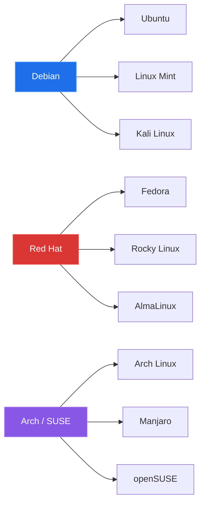

# Linux Y Su Importancia Actual

## Que Es Linux

Linux es un sistema operativo libre, de codigo abierto y tipo Unix. Su componente central es el **kernel**, encargado de administrar recursos como CPU, memoria, disco, red y dispositivos.

Una distribucion Linux toma ese kernel y le agrega herramientas, instalador, repositorios, configuracion y utilidades listas para usar.

Ejemplos comunes:

- Ubuntu
- Debian
- Fedora
- Rocky Linux
- Kali Linux
- Arch Linux

### Analogia Rapida

Puedes pensar en Linux como el motor de un vehiculo. El kernel es el motor; la distribucion es el vehiculo completo con tablero, ruedas, asientos, herramientas y manual de uso.

## Por Que Linux Domina Servidores, Nube Y Ciberseguridad

Linux es la base de gran parte de la infraestructura moderna.

| Area | Por que importa Linux |
|---|---|
| Servidores | Estabilidad, bajo consumo, administracion remota y automatizacion |
| Nube | Muchos servicios cloud, contenedores y pipelines DevOps trabajan sobre Linux |
| Ciberseguridad | Herramientas de analisis, hardening, monitoreo y respuesta suelen ejecutarse en Linux |

Aprender Linux es aprender la base operativa de infraestructura, DevOps, redes y seguridad.

## Distribuciones: Mismo Nucleo, Distintos Objetivos

Todas usan Linux como base, pero cada distribucion tiene un enfoque distinto.

| Distribucion | Enfoque |
|---|---|
| Ubuntu Server | Servidores y aprendizaje |
| Debian | Estabilidad y base comunitaria |
| Rocky / RHEL | Empresa y produccion |
| Kali Linux | Seguridad ofensiva y laboratorios |

En esta sesion se usa **Ubuntu Server** por ser estable, popular y amigable para empezar.

## Familias De Distribuciones Linux

Las distribuciones se agrupan por familias. La familia define repositorios, formato de paquetes, comandos de instalacion y ciclo de actualizaciones.

## Entornos De Escritorio Vs Gestores De Ventanas

Un **entorno de escritorio** ofrece una experiencia grafica completa: paneles, menus, configuracion y aplicaciones base.

Ejemplos:

- GNOME
- KDE Plasma
- XFCE
- Cinnamon

Un **gestor de ventanas** controla como se abren y acomodan las ventanas. Puede ser flotante o tipo mosaico.

Ejemplos:

- i3
- Openbox
- AwesomeWM
- Sway

En servidores, normalmente no se instala entorno grafico. Ubuntu Server se administra desde terminal.

## Paqueteria Y Gestores De Paquetes

Un repositorio es un servidor confiable desde donde la distribucion descarga software y actualizaciones. Un paquete es un archivo instalable que incluye programa, version, metadatos y dependencias.

| Familia | Formato | Gestor | Ejemplo |
|---|---|---|---|
| Debian / Ubuntu | `.deb` | `apt` | `sudo apt install vim` |
| Red Hat / Fedora | `.rpm` | `dnf` | `sudo dnf install vim` |
| Arch / Manjaro | `pkg.tar.zst` | `pacman` | `sudo pacman -S vim` |
| openSUSE / SUSE | `.rpm` | `zypper` | `sudo zypper install vim` |

## Formatos Universales De Instalacion

Ademas de los paquetes tradicionales, existen formatos universales.

| Formato | Uso comun |
|---|---|
| Snap | Usado por Ubuntu; apps autocontenidas |
| Flatpak | Popular en escritorio; repositorios como Flathub |
| AppImage | Archivo ejecutable portable; no requiere instalacion tradicional |

En servidores se priorizan repositorios oficiales. En escritorio aparecen mas formatos universales.

---

[Siguiente: Ubuntu Server en VirtualBox](./02-ubuntu-server-virtualbox.md)
