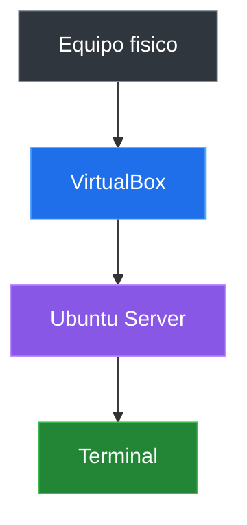

# Ubuntu Server En VirtualBox

## Objetivo Del Entorno Virtual

La maquina virtual permite practicar Linux sin modificar el sistema principal.

El flujo de trabajo es:



La idea es crear un servidor real dentro de una maquina virtual para repetir, romper y reconstruir el laboratorio con seguridad.

## Requisitos Para La Instalacion

### Software

- Oracle VirtualBox instalado.
- ISO de Ubuntu Server.
- Conexion a internet para descargas.

### Recursos Sugeridos

| Recurso | Recomendacion |
|---|---|
| RAM | 2 GB como minimo |
| CPU | 2 nucleos si estan disponibles |
| Disco | 20 GB dinamico |
| Red | NAT para empezar |

Antes de iniciar, verifica que la virtualizacion este habilitada en BIOS/UEFI si VirtualBox no permite crear maquinas de 64 bits.

## Crear La Maquina Virtual

Pasos generales:

1. Crear una nueva VM: Linux / Ubuntu (64-bit).
2. Asignar memoria y procesadores.
3. Crear disco duro virtual VDI, reservado dinamicamente.
4. Montar la ISO de Ubuntu Server en la unidad optica.
5. Iniciar la VM y seguir el instalador.

La meta es terminar con un servidor Ubuntu arrancando y pidiendo usuario/contrasena en consola.

## Decisiones Dentro Del Instalador

Configuracion base:

- Idioma y teclado.
- Red por DHCP.
- Disco completo para la VM.
- Usuario administrador del laboratorio.
- Instalar OpenSSH si se usara acceso remoto.
- No instalar extras innecesarios.

Perfil recomendado:

| Campo | Valor sugerido |
|---|---|
| Nombre del servidor | `linux-lab` |
| Usuario | `pit` |

## Primer Ingreso Al Servidor

Inicia sesion con el usuario creado durante la instalacion. Luego confirma tres cosas:

- Quien eres dentro del sistema.
- Como se llama el servidor.
- Donde estas ubicado.
- Si la red esta activa.

Comandos iniciales:

```bash
whoami
hostname
pwd
ip addr
```

### Lectura Del Prompt

El prompt es la linea donde escribes comandos. Normalmente muestra usuario, maquina y ubicacion.

```text
pit@linux-lab:~$
```

Esto se lee como: usuario `pit`, servidor `linux-lab`, carpeta actual `~`.

---

[Anterior: Linux y su importancia actual](./01-linux-importancia.md) | [Siguiente: Terminal y sistema de archivos](./03-terminal-sistema-archivos.md)
