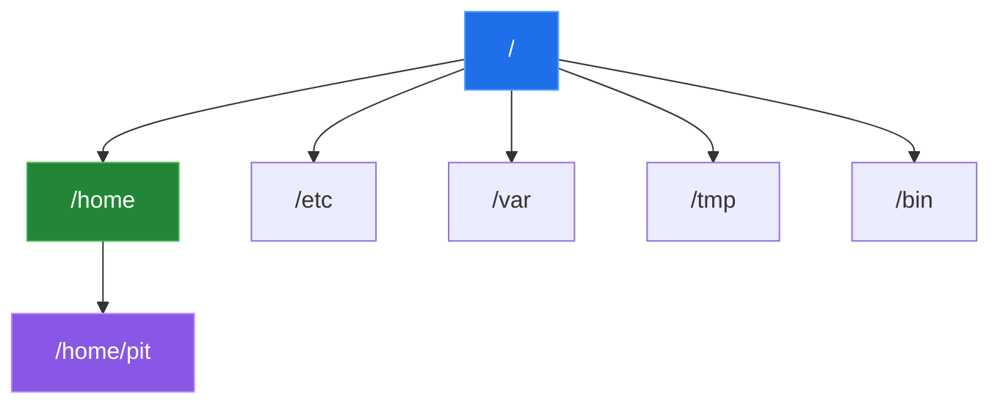

# Terminal, Shell Y Sistema De Archivos

## Terminal Y Shell

La **terminal** es la interfaz donde escribimos comandos.

La **shell** es el programa que interpreta esos comandos. En Ubuntu normalmente se usa **Bash**.


Analogia: la terminal es la ventanilla donde escribes una orden; la shell es quien entiende esa orden y la ejecuta en el sistema.

## Rutas Absolutas Y Relativas

Una **ruta absoluta** empieza desde la raiz del sistema:

```text
/home/pit/documentos/notas.txt
```

Una **ruta relativa** parte desde la ubicacion actual:

```text
documentos/notas.txt
```

En Linux todo vive dentro de un arbol que empieza en `/`. No existen unidades `C:` o `D:` como en Windows.

## Estructura Basica Del Sistema

| Directorio | Uso principal |
|---|---|
| `/` | Raiz del sistema |
| `/home` | Carpetas de usuarios |
| `/etc` | Configuracion del sistema |
| `/var` | Datos variables como logs |
| `/tmp` | Archivos temporales |
| `/bin` | Comandos esenciales |



La primera practica se concentra en moverse por este arbol y crear una estructura propia.

## Idea Clave

Para usar Linux con confianza no necesitas memorizar todo el arbol del sistema desde el primer dia. Necesitas saber donde estas, como moverte y como leer rutas.

---

[Anterior: Ubuntu Server en VirtualBox](./02-ubuntu-server-virtualbox.md) | [Siguiente: Comandos esenciales](./04-comandos-esenciales.md)
