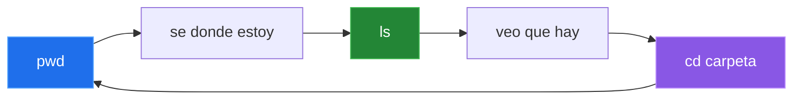

# Comandos Esenciales

## Comandos Para Navegar

Estos comandos ayudan a saber donde estas y moverte por el sistema.

| Accion | Comando |
|---|---|
| Mostrar ruta actual | `pwd` |
| Listar contenido | `ls` |
| Listar detalles y ocultos | `ls -la` |
| Entrar a una carpeta | `cd carpeta` |
| Subir un nivel | `cd ..` |
| Volver al home | `cd ~` |
| Limpiar pantalla | `clear` |

Flujo mental:



## Comandos Para Crear Y Gestionar

| Accion | Comando |
|---|---|
| Crear carpeta | `mkdir proyecto` |
| Crear ruta completa | `mkdir -p app/src` |
| Crear archivo vacio | `touch notas.txt` |
| Editar archivo | `nano notas.txt` |
| Copiar | `cp origen destino` |
| Mover o renombrar | `mv origen destino` |
| Eliminar archivo | `rm archivo` |
| Eliminar carpeta con contenido | `rm -r carpeta` |

> Precaucion: antes de eliminar con `rm`, confirma tu ruta con `pwd` y revisa con `ls`.

## Ver Contenido De Archivos

| Accion | Comando |
|---|---|
| Mostrar todo el archivo | `cat archivo` |
| Ver primeras lineas | `head archivo` |
| Ver ultimas lineas | `tail archivo` |
| Lectura navegable | `less archivo` |

## Buenas Practicas Iniciales

- Usa nombres claros.
- Evita espacios en rutas al empezar.
- Organiza por carpetas.
- Lee mensajes de error con calma.
- Antes de borrar, revisa donde estas.

## Mini Practica

```bash
pwd
ls -la
mkdir practica
cd practica
touch notas.txt
echo "Hola Linux" > notas.txt
cat notas.txt
cd ..
```

---

[Anterior: Terminal y sistema de archivos](./03-terminal-sistema-archivos.md) | [Siguiente: Identidad, usuarios y sudo](./05-identidad-usuarios-grupos-sudo.md) | [Laboratorio: estructura de proyecto](../laboratorios/estructura-proyecto-linux.md)
