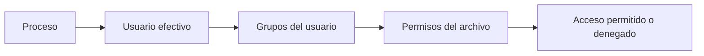

# Identidad En Linux: Usuarios, Grupos Y Sudo

## Objetivo

Entender como Linux controla el acceso mediante identidades. Antes de cambiar permisos, hay que saber quien ejecuta los procesos, a que grupos pertenece y cuando necesita privilegios administrativos.

## Modelo Mental

Linux decide el acceso combinando tres elementos:

- **Usuario**: identidad que ejecuta comandos y procesos.
- **Grupo**: conjunto de usuarios usado para compartir permisos.
- **Otros**: cualquier usuario que no sea propietario ni pertenezca al grupo propietario del recurso.

Cada archivo o directorio tiene un propietario y un grupo propietario. Los permisos se aplican sobre usuario, grupo y otros.



## Usuarios, Root Y Sudo

`root` es el administrador total del sistema. Puede modificar archivos criticos, instalar paquetes, crear usuarios y cambiar permisos globales.

La practica recomendada es trabajar con un usuario normal y usar `sudo` solo cuando la accion requiere privilegios.

```bash
whoami
id
groups
sudo -l
sudo whoami
```

## Gestion Basica De Cuentas Y Grupos

```bash
sudo adduser ana
sudo adduser luis
sudo groupadd devops
sudo usermod -aG devops ana
sudo usermod -aG devops luis
id ana
id luis
groups ana
groups luis
```

> Usa `usermod -aG`: `-a` agrega sin borrar grupos previos y `-G` define grupos suplementarios.

## Archivos Relacionados Con Identidad

| Archivo | Funcion |
|---|---|
| `/etc/passwd` | Lista usuarios, UID, GID principal, home y shell |
| `/etc/shadow` | Guarda hashes de contrasenas y politicas de expiracion |
| `/etc/group` | Define grupos y miembros suplementarios |
| `/etc/sudoers` | Controla quien puede usar privilegios administrativos |

Consultar sin modificar:

```bash
getent passwd ana
getent group devops
sudo tail -n 5 /etc/passwd
sudo tail -n 5 /etc/group
sudo ls -l /etc/passwd /etc/shadow /etc/group /etc/sudoers
```

No edites `/etc/sudoers` directamente con un editor comun. Usa:

```bash
sudo visudo
```

## Micro-Lab: Reconocer Identidad Y Privilegios

```bash
whoami
id
groups
sudo -l
sudo whoami
```

Responde:

- Cual es tu usuario?
- Cual es tu grupo principal?
- Puedes usar `sudo`?
- Que diferencia hay entre `whoami` y `sudo whoami`?

## Checklist

- Puedo diferenciar usuario, grupo y otros.
- Puedo explicar por que no se trabaja siempre como `root`.
- Puedo consultar identidad con `whoami`, `id` y `groups`.
- Puedo crear usuarios y grupos de laboratorio.
- Puedo usar `sudo` como elevacion temporal.

---

[Anterior: Comandos esenciales](./04-comandos-esenciales.md) | [Siguiente: Permisos, propietarios y modos](./06-permisos-propietarios-modos.md)

